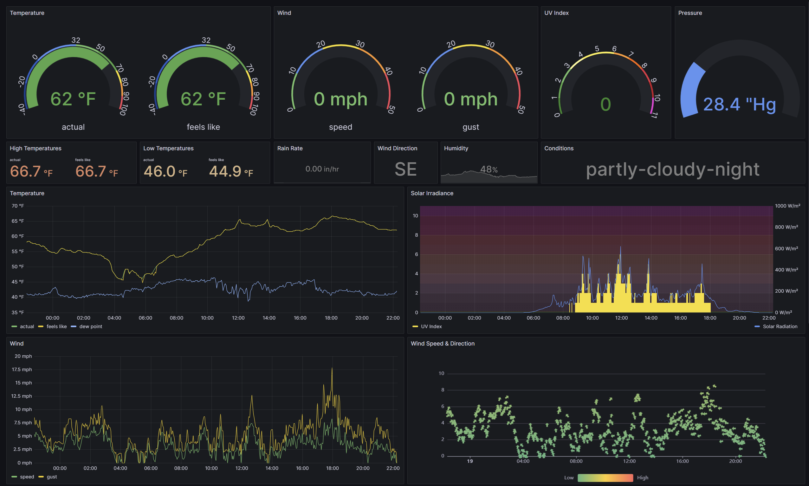
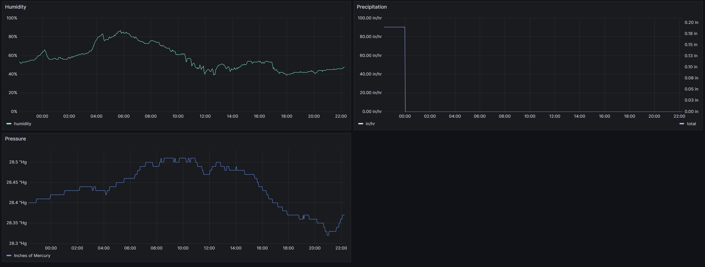
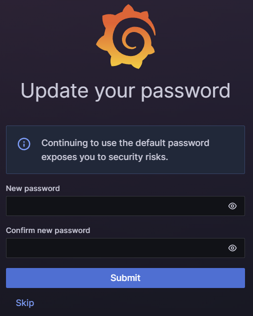
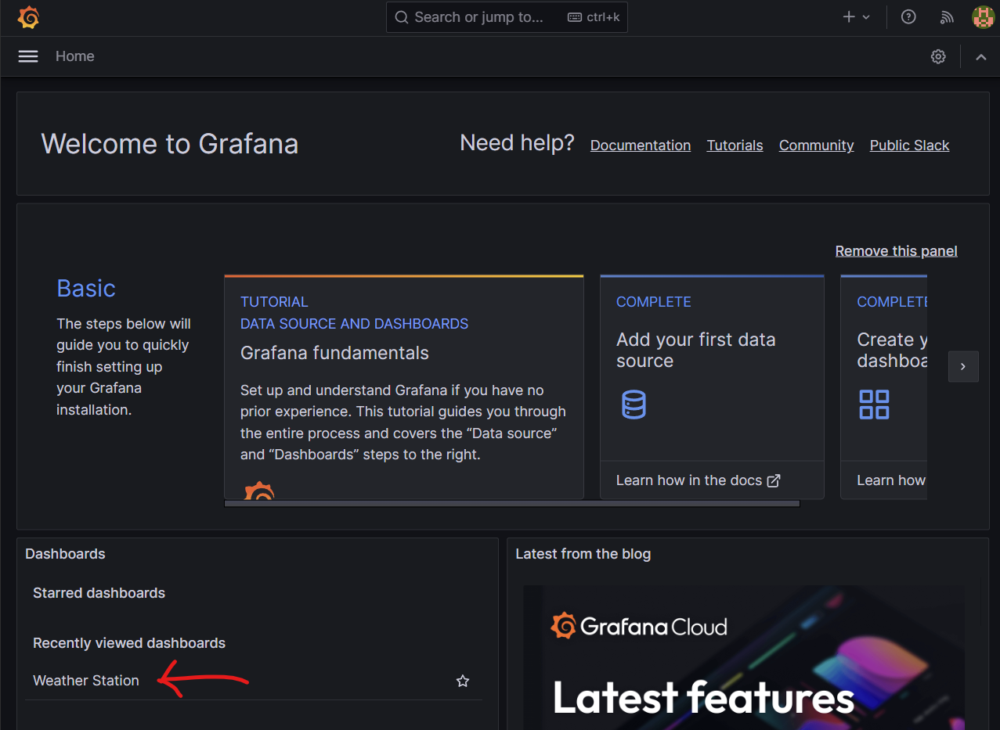
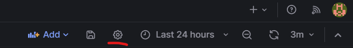
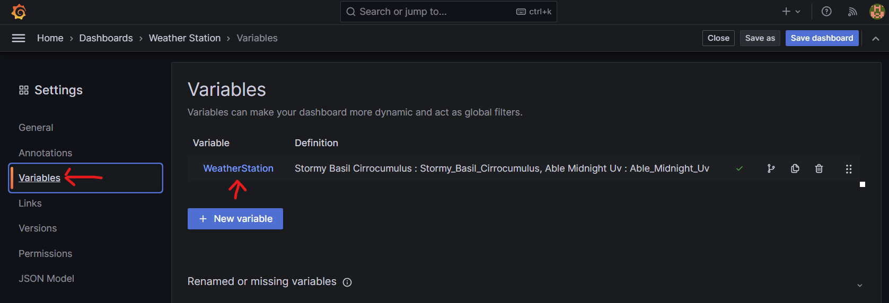
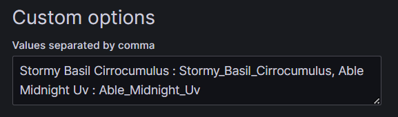
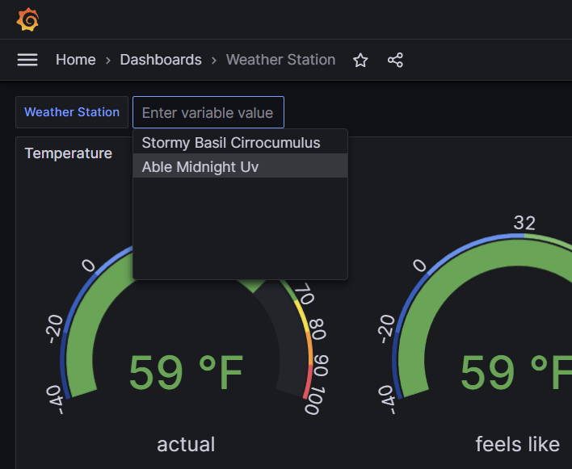

# WeatherXM API Python Scripts
A collection of scripts that use the [WeatherXM API](https://api.weatherxm.com/api/v1/docs/) to get weather station data for various purposes.  

Additionally a [Dockerized setup with Grafana and MySQL Server](#Docker-Compose-with-Grafana-and-MySQL-Server) is avaiable.

This repository is not affiliated with or endorsed by [WeatherXM](https://weatherxm.com/).

## Dependancies
Python of course.  [Python 3](https://www.python.org/downloads/) is required to run these python scripts.  

Additionally, use pip (Python Package Manager that should come with Python) to install the following Python libraries:
``` bash
pip install requests json
```

## Instructions
These Python scripts are designed to be run on a schedule.  On Linux and Windows you can use built-in tools like Cron and Task Scheduler.  On macOS you may need to download and install a 3rd party task scheduler. 

There are two methods to access weather station data from the WeatherXM API.  

#### __1. Public WeatherXM Explorer__
Anyone can access data via the public WeatherXM explorer API.  New data accessed via this method is available about every 6 minutes.  
To do this, enter your weather station 3-word name into the constant near the top of the script:
``` python
# WeatherXM Device Info
# Leave the username and password fields blank if the public API is desired.
WXM_USERNAME = ""
WXM_PASSWORD = ""
WXM_STATION_NAME = "Stormy Basil Cirrocumulus"
```

#### __2. Private WeatherXM Account__
If you are a weather station owner with a WeatherXM account, your device data can be accessed with your username and password.  New data accessed via this method is availabel about every 3 minutes.  
Enter your weather station 3-word name, along with your username and password, into the constant variables near the top of the script:
``` python
# WeatherXM Device Info
# Leave the username and password fields blank if the public API is desired.
WXM_USERNAME = "yourusername"
WXM_PASSWORD = "yoursecretpassword1"
WXM_STATION_NAME = "Stormy Basil Cirrocumulus"
```
___IMPORTANT___  
Note that while the secure HTTPS protocal is used and therefore your username and password IS encrypted when transmitted, it is NOT encrypted while at rest in this script on whatever machine you use to execute it.  Ideally WeatherXM would provide a way to generate a revocable API key with limited permission that could be used for this purpose.  As of yet, I am not aware of this ability.  Ensure you trust the machine you are using to execute this script and USE AT YOUR OWN RISK!  

### __wxm_to_tagoio.py Script__
This script depends on the `base_functions.py` script. Ensure you place both scripts in the same location.  
To send the data to a Tago.io device using this script a Tago.io device token is required.  Within the Tago.io admin login, create a "Custom HTTPS" device.  Then either generate a new token or use the default one created with the device.  Enter this token into the constant "TAGOIO_DEVICE_TOKEN".
``` python
# Create a Tago.io "Custom HTTPS" device and enter the token here.
TAGOIO_DEVICE_TOKEN = "4a4ca431-f267-483a-92b7-735fe5be1b80"
```

In order to prevent duplicate entries, this script first queries the Tago.io device's last temperature entry and compares its timestamp against the data retrieved from the weather station.  If the timestamps match then no data is sent to Tago.io.    

Any metrics you are not interested in can be commented out from the tago_payload.

### __wxm_to_mysql.py Script__
This script depends on the `base_functions.py` script. Ensure you place both scripts in the same location.  
This script can be used to send WeatherXM weather station data to a MySQL Server.  For convenience a SQL script for creating a compatable table is included (create_table.sql).  

This script depends on the MySQL Connector and the pytz timezone library which can both be installed with the Python Package installer by running:
``` bash
pip install mysql-connector-python pytz
```

To be able to connect to your MySQL database be sure to fill in the following information near the top of the script:
``` python
# MySQL Database Info
DB_HOST = "192.168.1.201"
DB_PORT = "6603"
DB_USER = "dbusername"
DB_PASSWORD = "dbpassword"
DB_DATABASE = "dbname"
```  

No instructions are provided for how to properly setup a MySQL database server, enabled remote connections, create databases, or create tables.  

## Conversion Options
If you wish to convert from the default WeatherXM units, this script provides some alternative units.  You can enable these conversions near the top of the script.  
``` python
# Conversion Options
C_TO_F = True
METERSPERSECOND_TO_MPH = False
MM_TO_INCH = False
HPA_TO_INHG = False
```
Additionally, converting from wind direction in degrees to cardinal directions is provided by default and included as a seperate variable (wind_direction_cardinal).  While seeing the wind direction displayed in cardinal form is easier to interpret, having it in degrees is useful if you want to be able to show a directional arrow.  

## Additional Options
### Device Information
Some additional information about the weather station is available if using a username and password. For WS1000 and WS2000 stations, the level of the battery can be read as either "ok" or "low".  For WS2000 stations only, the last Helium hotspot name and the last Helium received signal strength indication (rssi) is also available.  To get this information, set `GET_DEVICE_INFO` to `True`.
``` python
GET_DEVICE_INFO = False
```

## Schedule Examples
### Cron
On Debian/Ubuntu systems, cron can be used to schedule the excution of the script.  
Open a terminal and enter the following command to edit the cron table:
``` bash
crontab -e
```
To run a script every 3 minutes add the following line:
``` bash
*/3 * * * * /usr/bin/python3 /home/yourusername/path/to/scripts/wxm_to_tagoio.py >/dev/null 2>&1
```
Save when exiting and the cron job will start being executed.  

### Windows Task Scheduler
On Windows operating systems you can use the Task Scheduler to schedule the execution of Python scripts.  

Search for and open Task Scheduler.  
Create Task...  
Name the task.  
Create a new trigger, begin the task on a schedule, daily, every 1 day, repeat task every - manually type "3 minutes", for a duration of "indefinitely".  
Create a new action, action: "Start a program", "Programs/Script" input the path to python.exe, "Add Arguments" input the script file name, "Start in" input the path to where the script file is saved.  
Add any "Conditions" or "Settings" you prefer.

For example:  
Path to Python: C:\Users\yourusername\AppData\Local\Programs\Python\Python311\python.exe  
Script File Name: ./wxm_to_tagoio.py  
Path to Location where Script is Saved: C:\path\to\scripts\

# Docker Compose with Grafana and MySQL Server
--Note that this is still a work in progress--  
Docker Compose provides a relatively simple/automated way to setup the required components to collect WeatherXM station data and host your own MySQL database server and Grafana web server to store and visualize WeatherXM weather station data.  A default Weather Station dashboard is also included.  This should run on Windows, MacOS, and most Linux distros.  



## Install Docker
Docker is required to execute the Docker containers required for this application.  The process to install Docker is different on each platform.  Follow the [official Docker install documents](https://docs.docker.com/engine/install/) for how to install it on your system.

### Clone the repo
``` bash
git clone -b dockerized-with-grafana-and-mysql https://github.com/mickied/wxm-api-scripts.git
```

### Prepare the `.env` File
Navigate to the `docker` folder and edit the .env file.  This file contains configuration data necessary for setting up the various Docker containers.

``` properties
USER_ID=1000  # needs to be the value of "id -u"
MYSQL_ROOT_PASSWORD=SuperSecretSquirrelPassword
MYSQL_DATABASE_NAME=WeatherStations
MYSQL_USERNAME=wxm_writer
MYSQL_PASSWORD=wxm_writer1
UPDATE_RATE_MINUTES=3  # Should be set to 3 if not using username/password and 1.5 if using username/password.
WXM_USERNAME=
WXM_PASSWORD=
WEATHER_STATIONS='["Stormy Basil Cirrocumulus", "Able Midnight Uv"]'
C_TO_F=True
METERSPERSECOND_TO_MPH=True
MM_TO_INCH=True
HPA_TO_INHG=True
```
`USER_ID` - this field needs to be set to the numeric value assigned to the user running Docker compose.  For many this will likely be `1000` already, but you can find this value by executing `id -u` on your machine (note that for Windows this needs to be done in the WSL instance, NOT in Windows Powershell or Command Prompt).  
`MYSQL_ROOT_PASSWORD` - the default password assigned to the root MySQL user.  Should to be set to something, but unless you want to login to MySQL Server, you probably won't need it again.
`MYSQL_DATABASE_NAME` - the name assigned to the MySQL database that will store all the weather station data.  
`MYSQL_USERNAME` - the MySQL user that will be used by the wxm-retriever container to insert data into the database.  
`MYSQL_PASSWORD` - the password for the above MySQL user.  
`UPDATE_RATE_MINUTES` - this is the rate at which the wxm-retriever container will check for updates from the WeatherXM API.  This should be set to 1/2 the update rate for the endpoint used.  The public data endpoint updates every 6 minutes, so the current default of 3 should be used.  The private data endpoint (used when a `WXM_USERNAME` and `WXM_PASSWORD` are entered) updates every 3 minutes so a value of 1.5 should be entered.  
`WXM_USERNAME` - this should be left blank if you wish to obtain data from the public endpoint.  If you have a WeatherXM account with owned station(s) then you can enter your username here and the private enpoint will be used to obtain your weather data.  
`WXM_PASSWORD` - the password for the above username.  Leave blank if you wish to obtain data from the public endpoint.  
`WEATHER_STATIONS` - this is a list of weather stations you wish to log data for.  If using the public endpoint, any valid weather station name can be entered.  If using the private endpoint then the station(s) must be owned or followed by your account.  Two example stations are provided to show the required format.  
`C_TO_F` - set to `True` if temperature in Farenheit is desired.  Set to `False` if Celcius is desired.  
`METERSPERSECOND_TO_MPH` - set to `True` if wind speed in miles per hour is desired.  Set to `False` if meters per second is desired.  
`MM_TO_INCH` - set to `True` if rain rate and accumulation in inches is desired.  Set to `False` if millimeters is desired.  
`HPA_TO_INHG` - set to `True` if pressure in inches of mercury is desired.  Set to `False` if hectopascals is desired.  

NOTE: A `False` entry uses WeatherXM's default unit while `True` applies a conversion.  Unit conversions can also be manually performed in Grafana.  

### Create and Start the Docker Containers
From the `docker` folder in this repo, execute the following command:
``` bash
docker compose up -d
```
This command will use the `docker-compose.yaml` file in this folder to find and download the required images then create, configure, and start the containers.  This may take a few minutes.  After the containers have been started, both the MySQL and Grafana containers will go through a provisioning process to setup the database, database connection, and weather dashboard.  This should take a few more minutes.  Once this process is complete, the data is saved locally in the `docker/volumes` folder structure so that it won't need to be recreated.  

### Login to the Grafana Web Server
The Grafana webserver is accessable through port 3000 (configurable from the `docker-compose.yaml` file, line 24).  If accessing the web server through a web browser on the same computer you can use the following address.  
http://localhost:3000/  

NOTE: If accessing the web server from a different computer on the same local network you'll need to enter the IP address of the machine that's hosting those services in place of `localhost`.  

Grafana will prompt you to login.  Use `admin`/`admin` as the default username/password.  
  

Grafana will then prompt you to create a new password.  
  

The welcome page will load.  Click the "Weather Station" dashboard.  
  

### Change the Weather Station Dashboard Variables

If the default stations were changed in the `.env` file, then the dashboard will show errors.  We need to change some dashboard variables so Grafana can query the station data from the database tables that have been automatically created for each station.  
To do this, click the settings gear in the upper right hand bar.  
  

Click "Variables" from the menu on the left.  Then click the variable "WeatherStation".  
  

Go to the "Custom Options" field.  Here you will enter your station name followed by a `:` and then the station name again but with underscores instead of spaces.  If you have more than one station then seperate each entry with a comma.  See the example provided.  
Once complete, be sure to click "Apply" at the bottom of the page!  
  

Now you should be able to select your weather stations from the "Weather Station" dropdown list in the upper lefthand corner of the dashboard.  
  
